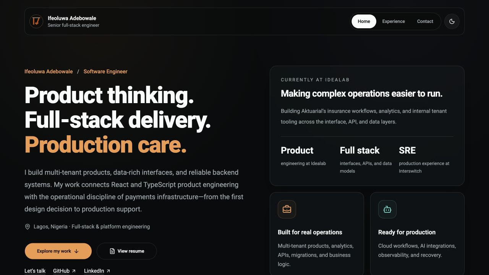
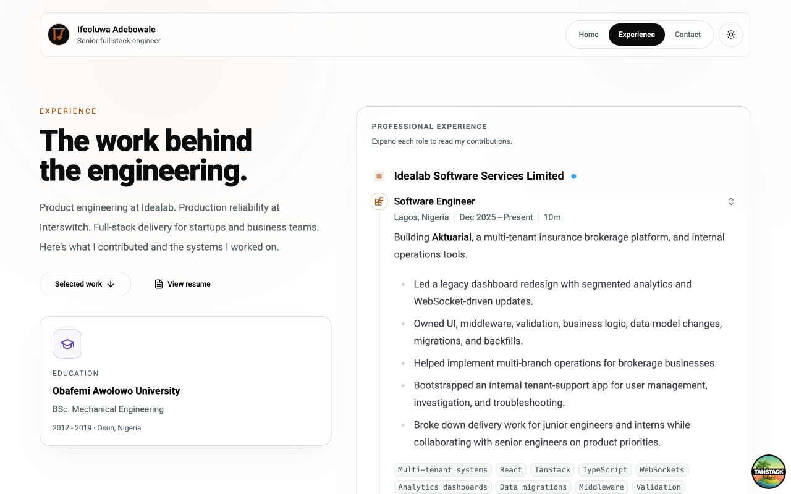
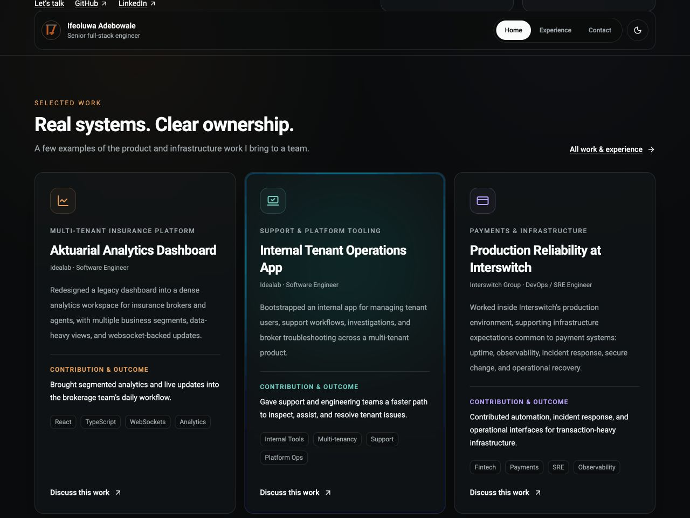
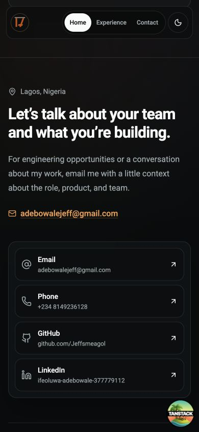
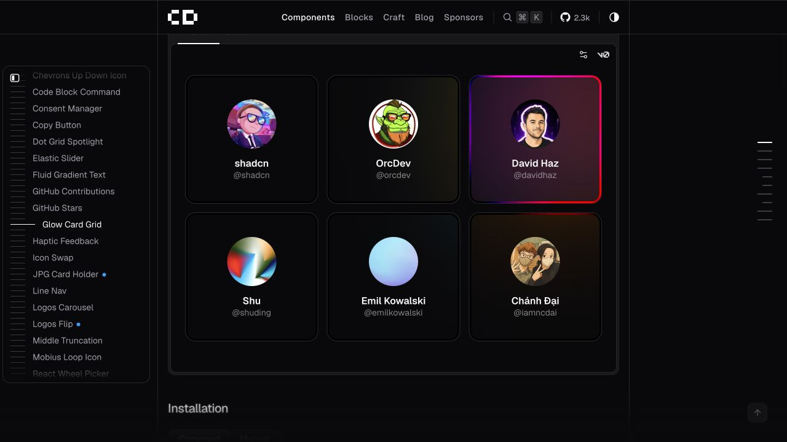
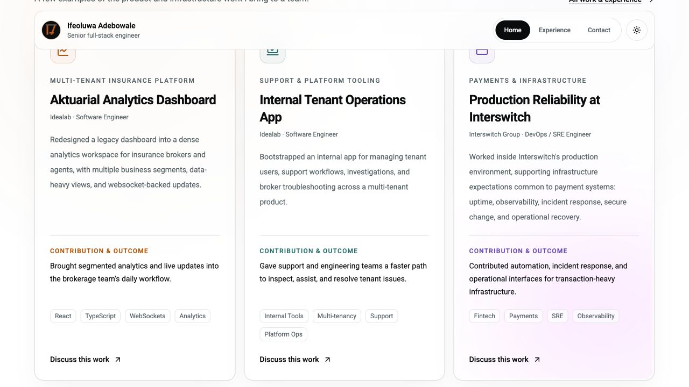

# Portfolio review — 30 September 2026

The portfolio now leads with specific engineering work, makes the resume and contact routes easy to find, and uses a shared glow implementation across the existing card surfaces. This was a local code and browser review; nothing was deployed.

## Recruiter journey

1. **Homepage — improved.** The original headline took most of the opening viewport, and its statistics mixed experience with an ambiguous uptime claim. The updated page puts your name, focus, current employer, resume, and work links together. It features three attributable examples before the toolkit. [Before](01-home-before.png).

   

2. **Experience — improved.** The original current-role description was a wall of text. It is now a short introduction plus specific contributions. Dates use readable month names; locations are no longer announced as employment types. The existing expandable roles remain keyboard operable. [Before](02-experience-before.png).

   

3. **Selected work and glow — improved.** The old carousel dimmed and clipped neighboring projects. All six work summaries now appear in a responsive grid, with employer/engagement context, contributions, technologies, and an email action. The homepage features the analytics dashboard, tenant operations, and Interswitch work. [Before](03-projects-before.png).

   

4. **Contact and mobile navigation — improved.** Contact labels are visible, long URLs wrap, and the LinkedIn URL matches the URL already present in the sibling resume codebase. The header fits at 320px; keyboard focus is visible and a skip link moves focus into the main content. Mail and telephone links use their native schemes; no messages were sent.

   

## Reference fidelity

The reference is [Chánh Đại’s Glow Card Grid](https://chanhdai.com/components/glow-card-grid). The original portfolio already had its grid controller, but `HoverGlowCard` only drew a radial pseudo-element. It did not use the blurred artwork or masked border, so effect parameters did not control the visible cards.

Both card variants now share a blurred artwork layer and masked backdrop-filter border. Defaults follow the reference (16px radius, 3px glow border). The portfolio uses its own icons and amber, teal, and violet accents instead of the example’s avatars. Text cards keep natural height rather than using size containment. Light mode intentionally has a softer glow. Pointer updates are coalesced per animation frame; distant cards deactivate, scrolling updates coordinates, and touch/reduced-motion input does not trigger tracking. Keyboard focus receives a static highlight.

## Implementation fixes

- Removed initial hidden/animated wrappers from primary content so server-rendered text is readable before JavaScript runs.
- Added a first-paint theme script that honors saved/system preference and tolerates blocked storage; theme transitions respect reduced motion.
- Added route-specific experience metadata, social metadata, and a useful 404 recovery path.
- Restricted devtools to development and kept the Netlify adapter in production builds, without requiring Netlify services for ordinary local development.
- Marked decorative icon artwork as hidden from assistive technology. Decorative hover handlers use the existing documented lint exemption; this does not turn icons into fake controls.
- Retained the upstream glow-card MIT notice in `licenses/chanhdai-MIT.txt`.

## Content that needs your evidence

- The existing “50%+” modernization claim remains in its original experience/project context. Add the baseline, measurement method, affected flow, and timeframe before using it as a headline metric.
- No new client names, performance figures, repository URLs, screenshots, or testimonials were invented. Public demos or employer-approved screenshots would make the work substantially easier to evaluate.
- The original six-year and uptime headline statistics were replaced with specific role/discipline context. The listed history begins in 2021; earlier work can be added if supplied.
- Confirm whether overlapping TV Deluxe and independent work should be explicitly labeled as concurrent engagements.
- The corrected LinkedIn URL is grounded in your existing resume source. The remote resume endpoint could not be independently fetched by the web tool; confirm its availability before sharing widely.

## Verification limits

Final checks passed: `npx tsc --noEmit`, `npm run lint` (47 files), `npm test` (8 tests), `npm run build`, and `git diff --check`. The rebuilt production preview had no browser console errors or warnings during the final homepage/project check. The 404 recovery link returns to the homepage; the footer's back-to-top target also exists on the 404 page.

Compatible transitive dependency updates were applied, and the shadcn scaffolding CLI was moved to development dependencies. `npm audit --omit=dev` decreased from 13 advisories to 1 low-severity esbuild advisory (GHSA-g7r4-m6w7-qqqr, Windows development-server file access). The full audit still reports 23 entries: 13 high, 7 moderate, and 3 low, including Netlify and test/build tooling. These counts include affected parent dependency chains and are not 23 independently demonstrated application exploits. Further targeted tooling updates and npm's fix planner both fail in the installed npm 11.3.0 with `Cannot read properties of null (reading 'edgesOut')`. No forced major-version updates or audit overrides were applied. Dependency remediation remains open; this is not a clean security audit.

Browser checks cover the local Chromium-based in-app browser, desktop, 390px and 320px layouts, both color themes, keyboard disclosure, skip navigation, contact anchors, and glow rendering. This is not a full assistive-technology or cross-browser certification. Real touch devices, Safari/Firefox, recruiter analytics, and production hosting behavior require separate checks. The build currently reports a large main JavaScript chunk; a future performance pass can reduce the framework/animation footprint.

## Follow-up refinements — 1 October 2026

- Project cards use CSS subgrid to align contribution headings, technology lists, and footer actions within each responsive row. Desktop and tablet row positions were measured in the browser; mobile cards retain natural heights without horizontal overflow.
- The navbar is now capped at 960px with tighter desktop vertical padding, following the requested compact proportions. Earlier screenshots show the prior navbar dimensions.
- Contact icons are controlled by hover and keyboard focus on their entire contact link, with reduced-motion preferences respected.
- VS Code custom CSS data recognizes the five Tailwind directives used in the stylesheet; flagged utility classes use canonical Tailwind syntax.
- Before committing, TypeScript, lint (48 files), all 8 tests, production build, and whitespace checks passed. The production build still reports the documented large main chunk.

